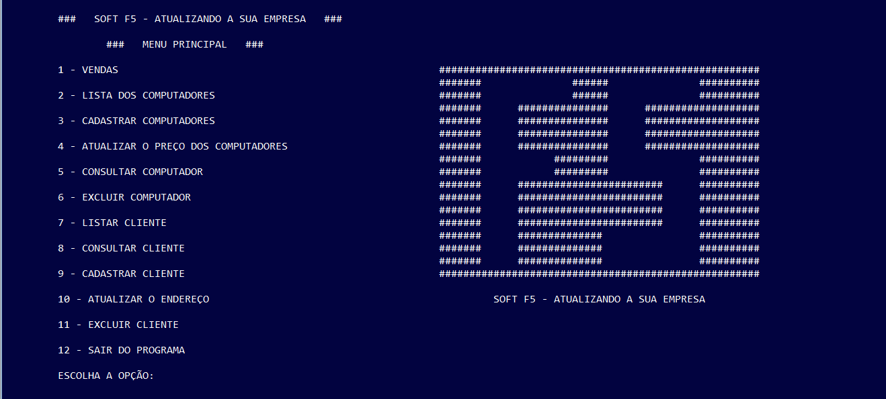

## Escola Técnica - Projeto Integrador I

###  :computer: Tela

  

----------

### :hammer_and_wrench: Ferramentas
As seguintes tecnologias foram utilizadas na construção do projeto:
-   Java;
-   Eclipse.

----------

###  :gear: Funções
- [x] PDV (Ponto de Venda);
- [x] CRUD de Computadores;
- [x] CRUD de Clientes.

----------

###  :eyeglasses: Autor
José Gustavo da Silva.
[
**Linkedin**
](https://www.linkedin.com/in/jose-gustavo312/)